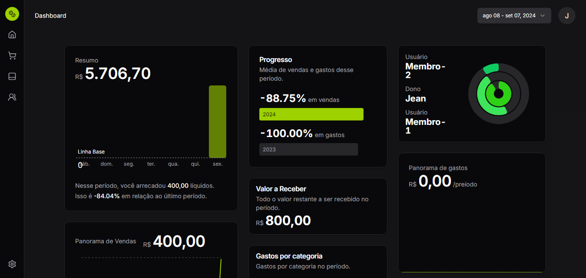
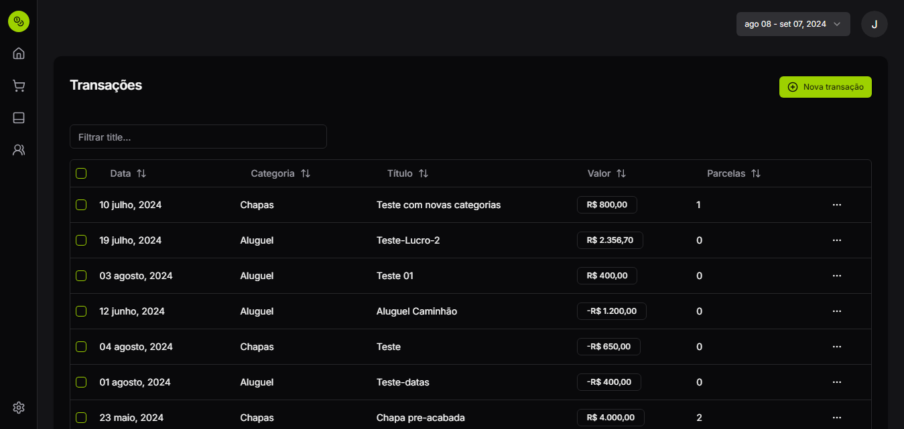
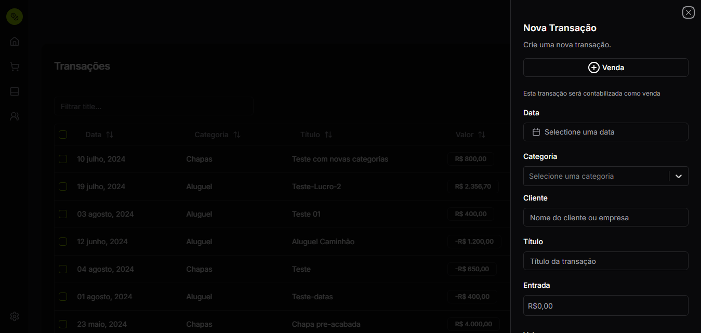

# CRIVO - Sistema de Gerenciamento
<!-- Adicione o logo aqui, se houver -->

**CRIVO** é um sistema de gerenciamento financeiro robusto e completo, com foco em fornecer uma visão clara e detalhada dos lucros, gastos e rentabilidade. Com uma dashboard intuitiva e fácil de navegar, o sistema oferece uma experiência integrada para análise financeira, controle de parcelas e gerenciamento total de transações, incluindo categorização de gastos.

## 🚀 Funcionalidades Principais
### 📊 Dashboard de Análise
Visão geral de lucros, gastos e rentabilidade: Acompanhe os principais indicadores financeiros de maneira visual e prática.
Gráficos interativos: Explore os dados de maneira intuitiva com gráficos detalhados.
Resumo financeiro completo: Compare o desempenho financeiro em diferentes períodos.
<!-- Exemplo de uma imagem da dashboard -->

### 💳 Controle de Parcelas
Gerenciamento de parcelas: Controle suas transações parceladas e acompanhe o status de cada pagamento.
Alertas automáticos: Notificações sobre parcelas pendentes e futuras.
<!-- Exemplo de imagem do controle de parcelas -->

### 💼 CRUD Completo de Transações
Adicionar, editar e remover transações: Gerencie suas transações de forma simples e eficaz.
Categorias de gastos: Organize suas despesas em categorias customizadas para uma visão clara de onde seu dinheiro está sendo gasto.
<!-- Exemplo de imagem do CRUD de transações -->

### 🏷️ Gerenciamento de Categorias de Gastos
Criação de categorias: Personalize e agrupe seus gastos para facilitar a análise.
Atribuição automática: Defina regras para que os gastos sejam automaticamente classificados na categoria correta.
### 📚 Tecnologias Utilizadas
Frontend: React, TypeScript
[Backend](https://github.com/devjcdzn/crivo-backend.git): Node.js, Prisma, Fastify
Banco de Dados: SQLite
Autenticação: JWT para segurança
Gerenciamento de Estado: React Query
UI/UX: ShadcnUI, Chart.js para gráficos

## 🔧 Instalação
1. Clone o repositório:

```bash
  git clone https://github.com/devjcdzn/crivo.git
```
Instale as dependências:

```bash
npm install
```

Execute o servidor:

```bash
npm run dev
```

Acesse a aplicação no navegador:

```bash
http://localhost:3000
```

## 🖼️ Screenshots
### Autenticação


### Dashboard Principal


### Controle de Transações




## 🛠️ Contribuições
Sinta-se à vontade para abrir um issue ou enviar um pull request para melhorias.

## 📄 Licença
Este projeto está licenciado sob a MIT License.